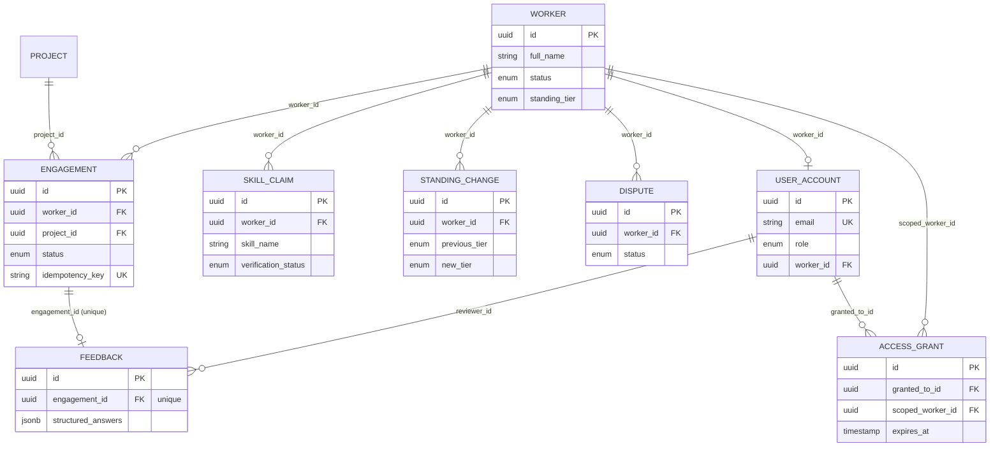

# Bonarda Works — Core Data Models & Production-Ready Database Schema

Companion to `bonarda-system-design.md` (§5, Data Strategy) and `PROJECT_STRUCTURE.md` (`backend/app/models/`). Defines the SQLAlchemy 2.0 async ORM layer with full static type safety — every column, relationship, and enum is typed so `mypy` catches a schema mismatch before it reaches a migration or a runtime query.

---

## 1. Type-safety approach

Three deliberate choices make this schema layer type-safe rather than just typed-looking:

1. **SQLAlchemy 2.0's `Mapped[]` / `mapped_column()` style throughout** — no legacy `Column()` declarations. `Mapped[str]` vs `Mapped[str | None]` is enforced by the ORM at the type-checker level, not just at the database level.
2. **Python `Enum` classes backed by native Postgres `ENUM` types**, not free-text strings — an invalid status can't be constructed in Python, let alone written to the database.
3. **ORM models (`models/`) and API schemas (`schemas/`) are separate classes**, bridged explicitly via `model_config = ConfigDict(from_attributes=True)` — a database column can be added or renamed without silently changing the public API contract, and vice versa (System Design §4, ORM rationale).

---

## 2. Base class and shared mixins

`backend/app/db/base.py`

```python
import uuid
from datetime import datetime

from sqlalchemy import DateTime, func
from sqlalchemy.dialects.postgresql import UUID as PG_UUID
from sqlalchemy.orm import DeclarativeBase, Mapped, mapped_column


class Base(DeclarativeBase):
    """Shared declarative base for all ORM models."""
    pass


class UUIDPrimaryKeyMixin:
    """Every table uses a server-generated UUID primary key, never an
    auto-increment integer — avoids leaking record counts/ordering and
    keeps IDs safe to expose in the public API."""

    id: Mapped[uuid.UUID] = mapped_column(
        PG_UUID(as_uuid=True),
        primary_key=True,
        server_default=func.gen_random_uuid(),
    )


class TimestampMixin:
    """created_at / updated_at on every table — required for the audit
    trail requirements (FR-7.3, NFR-3.3)."""

    created_at: Mapped[datetime] = mapped_column(
        DateTime(timezone=True),
        server_default=func.now(),
        nullable=False,
    )
    updated_at: Mapped[datetime] = mapped_column(
        DateTime(timezone=True),
        server_default=func.now(),
        onupdate=func.now(),
        nullable=False,
    )
```

---

## 3. Enums

`backend/app/models/enums.py`

```python
import enum


class WorkerStatus(str, enum.Enum):
    ACTIVE = "active"
    DORMANT = "dormant"      # FR-9.7 — not deleted between engagements
    OFFBOARDED = "offboarded"


class StandingTier(str, enum.Enum):
    UNRATED = "unrated"
    TIER_1 = "tier_1"
    TIER_2 = "tier_2"        # "Trusted" in the PM console mockup


class VerificationStatus(str, enum.Enum):
    UNVERIFIED = "unverified"
    SELF_REPORTED = "self_reported"
    BONARDA_VERIFIED = "bonarda_verified"   # FR-2.1/2.2 — requires 2+ corroborating reviews


class EngagementStatus(str, enum.Enum):
    DRAFT = "draft"
    PENDING_SIGNATURE = "pending_signature"
    AWAITING_SIGNATURE = "awaiting_signature"
    ACTIVE = "active"
    COMPLETED = "completed"
    CANCELLED = "cancelled"


class DisputeStatus(str, enum.Enum):
    OPEN = "open"
    UNDER_REVIEW = "under_review"
    RESOLVED = "resolved"
    DISMISSED = "dismissed"


class UserRole(str, enum.Enum):
    PM = "pm"
    PEOPLE_OPS = "people_ops"
    FINANCE = "finance"
    WORKER = "worker"          # freelancer/contractor — FR-9.3
    ADMIN = "admin"


class AuthProvider(str, enum.Enum):
    CORPORATE_SSO = "corporate_sso"    # FR-9.1
    MAGIC_LINK = "magic_link"          # FR-9.2
```

---

## 4. Core models

### 4.1 `Worker`

`backend/app/models/worker.py`

```python
import uuid
from datetime import date

from sqlalchemy import Index, String
from sqlalchemy.orm import Mapped, mapped_column, relationship

from app.db.base import Base, TimestampMixin, UUIDPrimaryKeyMixin
from app.models.enums import StandingTier, WorkerStatus


class Worker(UUIDPrimaryKeyMixin, TimestampMixin, Base):
    __tablename__ = "workers"

    full_name: Mapped[str] = mapped_column(String(200), nullable=False)
    base_location: Mapped[str | None] = mapped_column(String(120))
    status: Mapped[WorkerStatus] = mapped_column(
        default=WorkerStatus.ACTIVE, nullable=False
    )
    standing_tier: Mapped[StandingTier] = mapped_column(
        default=StandingTier.UNRATED, nullable=False
    )
    first_engaged_at: Mapped[date | None] = mapped_column()

    # FR-9.6 — one account persists across every engagement
    user_account_id: Mapped[uuid.UUID | None] = mapped_column(
        "user_account_id", nullable=True
    )

    engagements: Mapped[list["Engagement"]] = relationship(
        back_populates="worker", cascade="all, delete-orphan"
    )
    skill_claims: Mapped[list["SkillClaim"]] = relationship(
        back_populates="worker", cascade="all, delete-orphan"
    )
    standing_changes: Mapped[list["StandingChange"]] = relationship(
        back_populates="worker", cascade="all, delete-orphan"
    )
    disputes: Mapped[list["Dispute"]] = relationship(
        back_populates="worker", cascade="all, delete-orphan"
    )

    __table_args__ = (
        # Roster search (FR-4.1) almost never needs dormant/offboarded workers —
        # a partial index keeps that hot path small (System Design §5.2).
        Index(
            "ix_workers_active_status",
            "status",
            postgresql_where=(status == WorkerStatus.ACTIVE),
        ),
    )
```

### 4.2 `Project` and `Engagement`

`backend/app/models/engagement.py`

```python
import uuid
from datetime import date

from sqlalchemy import Boolean, CheckConstraint, ForeignKey, Index, String
from sqlalchemy.dialects.postgresql import UUID as PG_UUID
from sqlalchemy.orm import Mapped, mapped_column, relationship

from app.db.base import Base, TimestampMixin, UUIDPrimaryKeyMixin
from app.models.enums import EngagementStatus


class Project(UUIDPrimaryKeyMixin, TimestampMixin, Base):
    __tablename__ = "projects"

    name: Mapped[str] = mapped_column(String(200), nullable=False)
    client_name: Mapped[str | None] = mapped_column(String(200))

    engagements: Mapped[list["Engagement"]] = relationship(back_populates="project")


class Engagement(UUIDPrimaryKeyMixin, TimestampMixin, Base):
    __tablename__ = "engagements"

    worker_id: Mapped[uuid.UUID] = mapped_column(
        PG_UUID(as_uuid=True),
        ForeignKey("workers.id", ondelete="CASCADE"),
        nullable=False,
    )
    project_id: Mapped[uuid.UUID] = mapped_column(
        PG_UUID(as_uuid=True),
        ForeignKey("projects.id", ondelete="RESTRICT"),
        nullable=False,
    )
    status: Mapped[EngagementStatus] = mapped_column(
        default=EngagementStatus.DRAFT, nullable=False
    )
    start_date: Mapped[date | None] = mapped_column()
    end_date: Mapped[date | None] = mapped_column()
    is_reactivation: Mapped[bool] = mapped_column(Boolean, default=False, nullable=False)

    # FR-9.6/FR-8.2 — idempotency key prevents duplicate contract dispatch
    # on a double-click or client retry (System Design §6.1, §8.4).
    idempotency_key: Mapped[str | None] = mapped_column(String(64), unique=True)

    worker: Mapped["Worker"] = relationship(back_populates="engagements")
    project: Mapped["Project"] = relationship(back_populates="engagements")
    feedback: Mapped["Feedback | None"] = relationship(
        back_populates="engagement", uselist=False, cascade="all, delete-orphan"
    )

    __table_args__ = (
        # Dominant query: "this worker's history, most recent first"
        # (FR-1.6, PM console detail view) — System Design §5.2.
        Index("ix_engagements_worker_start_date", "worker_id", "start_date"),
        CheckConstraint(
            "end_date IS NULL OR start_date IS NULL OR end_date >= start_date",
            name="ck_engagement_date_order",
        ),
    )
```

### 4.3 `SkillClaim`

`backend/app/models/skill_claim.py`

```python
import uuid

from sqlalchemy import ForeignKey, Integer, String, UniqueConstraint
from sqlalchemy.dialects.postgresql import UUID as PG_UUID
from sqlalchemy.orm import Mapped, mapped_column, relationship

from app.db.base import Base, TimestampMixin, UUIDPrimaryKeyMixin
from app.models.enums import VerificationStatus


class SkillClaim(UUIDPrimaryKeyMixin, TimestampMixin, Base):
    __tablename__ = "skill_claims"

    worker_id: Mapped[uuid.UUID] = mapped_column(
        PG_UUID(as_uuid=True),
        ForeignKey("workers.id", ondelete="CASCADE"),
        nullable=False,
    )
    skill_name: Mapped[str] = mapped_column(String(120), nullable=False)
    verification_status: Mapped[VerificationStatus] = mapped_column(
        default=VerificationStatus.SELF_REPORTED, nullable=False
    )
    # FR-2.2 — a skill only becomes Bonarda-verified after 2+ corroborating
    # reviews; enforced in the service layer, tracked here for the badge display.
    corroborating_reviews: Mapped[int] = mapped_column(Integer, default=0, nullable=False)

    worker: Mapped["Worker"] = relationship(back_populates="skill_claims")

    __table_args__ = (
        UniqueConstraint("worker_id", "skill_name", name="uq_worker_skill"),
    )
```

### 4.4 `Feedback`

`backend/app/models/feedback.py`

```python
import uuid
from typing import Any

from sqlalchemy import ForeignKey, Text
from sqlalchemy.dialects.postgresql import JSONB, UUID as PG_UUID
from sqlalchemy.orm import Mapped, mapped_column, relationship

from app.db.base import Base, TimestampMixin, UUIDPrimaryKeyMixin


class Feedback(UUIDPrimaryKeyMixin, TimestampMixin, Base):
    __tablename__ = "feedback"

    engagement_id: Mapped[uuid.UUID] = mapped_column(
        PG_UUID(as_uuid=True),
        ForeignKey("engagements.id", ondelete="CASCADE"),
        unique=True,
        nullable=False,
    )
    reviewer_id: Mapped[uuid.UUID] = mapped_column(
        PG_UUID(as_uuid=True),
        ForeignKey("user_accounts.id", ondelete="SET NULL"),
        nullable=True,
    )

    # FR-2.3 — structured, behavior-specific questions are required;
    # free text is optional. Schema-level validation of required keys
    # happens in the Pydantic layer (see §6), not here.
    structured_answers: Mapped[dict[str, Any]] = mapped_column(JSONB, nullable=False)
    free_text: Mapped[str | None] = mapped_column(Text)

    engagement: Mapped["Engagement"] = relationship(back_populates="feedback")
```

### 4.5 `StandingChange`

`backend/app/models/standing_change.py`

```python
import uuid
from typing import Any

from sqlalchemy import ForeignKey
from sqlalchemy.dialects.postgresql import JSONB, UUID as PG_UUID
from sqlalchemy.orm import Mapped, mapped_column, relationship

from app.db.base import Base, TimestampMixin, UUIDPrimaryKeyMixin
from app.models.enums import StandingTier


class StandingChange(UUIDPrimaryKeyMixin, TimestampMixin, Base):
    """Append-only log — FR-3.3: every standing change is logged with
    contributing factors. Never updated or deleted, only inserted."""

    __tablename__ = "standing_changes"

    worker_id: Mapped[uuid.UUID] = mapped_column(
        PG_UUID(as_uuid=True),
        ForeignKey("workers.id", ondelete="CASCADE"),
        nullable=False,
    )
    previous_tier: Mapped[StandingTier] = mapped_column(nullable=False)
    new_tier: Mapped[StandingTier] = mapped_column(nullable=False)
    contributing_factors: Mapped[dict[str, Any]] = mapped_column(JSONB, nullable=False)

    worker: Mapped["Worker"] = relationship(back_populates="standing_changes")
```

### 4.6 `Dispute`

`backend/app/models/dispute.py`

```python
import uuid

from sqlalchemy import ForeignKey, Text
from sqlalchemy.dialects.postgresql import UUID as PG_UUID
from sqlalchemy.orm import Mapped, mapped_column, relationship

from app.db.base import Base, TimestampMixin, UUIDPrimaryKeyMixin
from app.models.enums import DisputeStatus


class Dispute(UUIDPrimaryKeyMixin, TimestampMixin, Base):
    __tablename__ = "disputes"

    worker_id: Mapped[uuid.UUID] = mapped_column(
        PG_UUID(as_uuid=True),
        ForeignKey("workers.id", ondelete="CASCADE"),
        nullable=False,
    )
    # Points at the record being disputed (a StandingChange.id or
    # Feedback.id) — intentionally not a typed FK, since it can reference
    # more than one table; integrity is enforced in the service layer.
    target_record_id: Mapped[uuid.UUID] = mapped_column(nullable=False)
    reason: Mapped[str] = mapped_column(Text, nullable=False)
    status: Mapped[DisputeStatus] = mapped_column(
        default=DisputeStatus.OPEN, nullable=False
    )
    resolution_notes: Mapped[str | None] = mapped_column(Text)

    worker: Mapped["Worker"] = relationship(back_populates="disputes")
```

### 4.7 `UserAccount` and `AccessGrant`

`backend/app/models/user_account.py`

```python
import uuid
from datetime import datetime

from sqlalchemy import ForeignKey, String
from sqlalchemy.dialects.postgresql import UUID as PG_UUID
from sqlalchemy.orm import Mapped, mapped_column, relationship

from app.db.base import Base, TimestampMixin, UUIDPrimaryKeyMixin
from app.models.enums import AuthProvider, UserRole


class UserAccount(UUIDPrimaryKeyMixin, TimestampMixin, Base):
    __tablename__ = "user_accounts"

    email: Mapped[str] = mapped_column(String(255), unique=True, nullable=False)
    role: Mapped[UserRole] = mapped_column(nullable=False)
    auth_provider: Mapped[AuthProvider] = mapped_column(nullable=False)

    # Set only for role == WORKER; internal staff link via SSO subject
    # claim instead, resolved at auth time rather than stored here.
    worker_id: Mapped[uuid.UUID | None] = mapped_column(
        PG_UUID(as_uuid=True), ForeignKey("workers.id", ondelete="CASCADE")
    )


class AccessGrant(UUIDPrimaryKeyMixin, TimestampMixin, Base):
    """FR-9.5 — scoped, time-boxed visibility for a PM outside their
    default project scope. Swept by the expire_access_grants job
    (NFR-3.8) rather than requiring manual revocation."""

    __tablename__ = "access_grants"

    granted_to_id: Mapped[uuid.UUID] = mapped_column(
        PG_UUID(as_uuid=True),
        ForeignKey("user_accounts.id", ondelete="CASCADE"),
        nullable=False,
    )
    scoped_worker_id: Mapped[uuid.UUID] = mapped_column(
        PG_UUID(as_uuid=True),
        ForeignKey("workers.id", ondelete="CASCADE"),
        nullable=False,
    )
    granted_by_id: Mapped[uuid.UUID] = mapped_column(
        PG_UUID(as_uuid=True),
        ForeignKey("user_accounts.id", ondelete="SET NULL"),
        nullable=True,
    )
    reason: Mapped[str] = mapped_column(String(500), nullable=False)
    expires_at: Mapped[datetime] = mapped_column(nullable=False)
```

---

## 5. Updated entity-relationship diagram

Reflects the actual foreign keys and constraints defined above (supersedes the conceptual ERD in the system design doc §5.1).



---

## 6. Bridging to the API — Pydantic schemas stay separate from ORM models

`backend/app/schemas/worker.py`

```python
import uuid
from datetime import date, datetime

from pydantic import BaseModel, ConfigDict

from app.models.enums import StandingTier, WorkerStatus


class WorkerRead(BaseModel):
    """Response shape — deliberately excludes internal-only fields
    (e.g. no raw user_account_id) that exist on the ORM model but
    should never appear in an API response verbatim."""

    model_config = ConfigDict(from_attributes=True)

    id: uuid.UUID
    full_name: str
    base_location: str | None
    status: WorkerStatus
    standing_tier: StandingTier
    first_engaged_at: date | None
    created_at: datetime


class WorkerUpdate(BaseModel):
    """Request shape for FR-1.5 (worker self-updates) — only the
    fields a worker is allowed to edit, nothing else."""

    base_location: str | None = None
```

`backend/app/schemas/feedback.py`

```python
import uuid

from pydantic import BaseModel, Field


class StructuredFeedbackAnswers(BaseModel):
    """FR-2.3 — required structured questions. A submission missing
    any of these is a 422 at the API boundary, not a soft warning
    (System Design §6.1)."""

    delivered_on_agreed_dates: bool
    handled_scope_changes_without_escalation: bool
    would_reengage: bool


class FeedbackCreate(BaseModel):
    structured_answers: StructuredFeedbackAnswers
    free_text: str | None = Field(default=None, max_length=2000)
    reviewer_id: uuid.UUID
```

---

## 7. Example Alembic migration

Generated via `alembic revision --autogenerate -m "create core tables"`, shown here illustratively for the `workers` and `engagements` tables:

```python
"""create core tables

Revision ID: 0001_create_core_tables
"""
import sqlalchemy as sa
from alembic import op
from sqlalchemy.dialects import postgresql

revision = "0001_create_core_tables"
down_revision = None


def upgrade() -> None:
    op.create_table(
        "workers",
        sa.Column("id", postgresql.UUID(as_uuid=True), primary_key=True,
                  server_default=sa.text("gen_random_uuid()")),
        sa.Column("full_name", sa.String(200), nullable=False),
        sa.Column("base_location", sa.String(120)),
        sa.Column(
            "status",
            sa.Enum("active", "dormant", "offboarded", name="workerstatus"),
            nullable=False,
            server_default="active",
        ),
        sa.Column(
            "standing_tier",
            sa.Enum("unrated", "tier_1", "tier_2", name="standingtier"),
            nullable=False,
            server_default="unrated",
        ),
        sa.Column("first_engaged_at", sa.Date()),
        sa.Column("created_at", sa.DateTime(timezone=True),
                  server_default=sa.func.now(), nullable=False),
        sa.Column("updated_at", sa.DateTime(timezone=True),
                  server_default=sa.func.now(), nullable=False),
    )
    op.create_index(
        "ix_workers_active_status", "workers", ["status"],
        postgresql_where=sa.text("status = 'active'"),
    )

    op.create_table(
        "engagements",
        sa.Column("id", postgresql.UUID(as_uuid=True), primary_key=True,
                  server_default=sa.text("gen_random_uuid()")),
        sa.Column("worker_id", postgresql.UUID(as_uuid=True),
                  sa.ForeignKey("workers.id", ondelete="CASCADE"), nullable=False),
        sa.Column("project_id", postgresql.UUID(as_uuid=True),
                  sa.ForeignKey("projects.id", ondelete="RESTRICT"), nullable=False),
        sa.Column("status", sa.Enum(
            "draft", "pending_signature", "awaiting_signature",
            "active", "completed", "cancelled", name="engagementstatus",
        ), nullable=False, server_default="draft"),
        sa.Column("start_date", sa.Date()),
        sa.Column("end_date", sa.Date()),
        sa.Column("is_reactivation", sa.Boolean(), nullable=False, server_default="false"),
        sa.Column("idempotency_key", sa.String(64), unique=True),
        sa.CheckConstraint(
            "end_date IS NULL OR start_date IS NULL OR end_date >= start_date",
            name="ck_engagement_date_order",
        ),
    )
    op.create_index(
        "ix_engagements_worker_start_date", "engagements", ["worker_id", "start_date"]
    )


def downgrade() -> None:
    op.drop_table("engagements")
    op.drop_table("workers")
    op.execute("DROP TYPE IF EXISTS engagementstatus")
    op.execute("DROP TYPE IF EXISTS standingtier")
    op.execute("DROP TYPE IF EXISTS workerstatus")
```

---

## 8. Constraints and indexing summary

| Table | Constraint / index | Purpose |
|---|---|---|
| `workers` | Partial index on `status = 'active'` | Keeps the roster-search hot path (FR-4.1) small |
| `engagements` | Composite index `(worker_id, start_date)` | Backs "this worker's history, most recent first" (FR-1.6) |
| `engagements` | `CHECK (end_date >= start_date)` | Data integrity at the DB level, not just app-level validation |
| `engagements` | `UNIQUE (idempotency_key)` | Enforces FR-9's idempotent reactivation at the storage layer, not just the API layer |
| `skill_claims` | `UNIQUE (worker_id, skill_name)` | A worker can't have two conflicting claims for the same skill |
| `feedback` | `UNIQUE (engagement_id)` | One structured feedback record per engagement, matching the 1:0..1 relationship |
| `user_accounts` | `UNIQUE (email)` | One account per email across both auth providers |
| `access_grants` | Index on `expires_at` | Supports the `expire_access_grants` sweep job (NFR-3.8) with a cheap range scan |
| `standing_changes` | None beyond FK — append-only, no updates | Table is intentionally insert-only; enforced by never exposing an update path in the service layer |

All foreign keys use explicit `ondelete` behavior — `CASCADE` where the child record is meaningless without its parent (a worker's engagements, skill claims, disputes), `RESTRICT` where deleting the parent should be blocked while children exist (a project with active engagements), and `SET NULL` where the relationship is informational, not structural (a reviewer's account being deactivated shouldn't delete the feedback they wrote).
