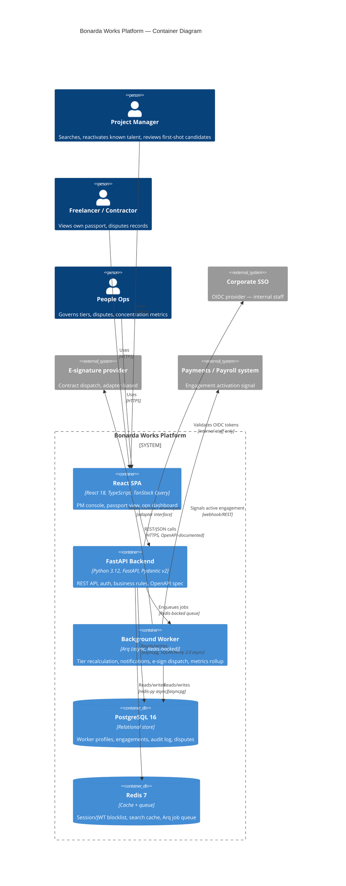
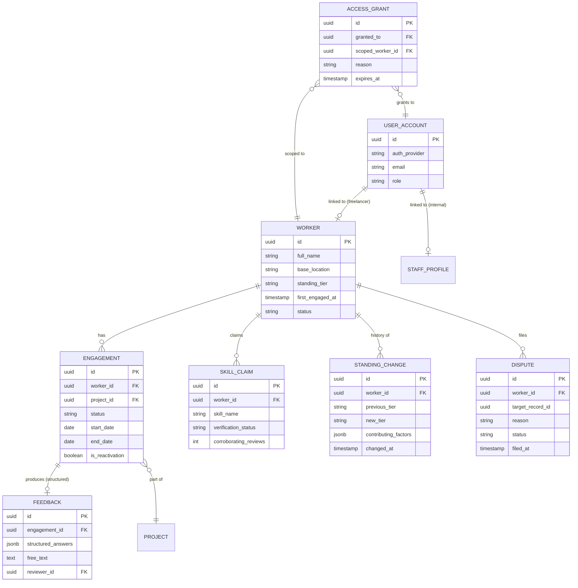
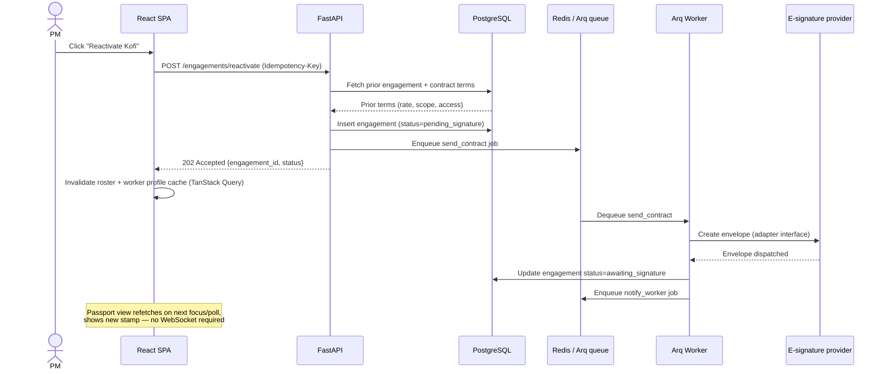

# Bonarda Works — Freelancer Passport & Reactivation Platform
### System Design Document (v1)

**Author:** Distinguished Senior Software Architect
**Input:** Bonarda Works Requirements Document (FR/NFR, Sections 1–11)
**Stack constraints:** Python 3.12+ / FastAPI backend, ReactJS frontend, REST + OpenAPI

---

## 1. Executive summary — the technical vision

We are building a single, async-native FastAPI service backed by PostgreSQL and Redis, fronted by a React SPA with server-state caching, so that a freelancer's history is read and written from exactly one source of truth regardless of whether a PM or the freelancer is looking at it. The architecture is deliberately a **modular monolith at launch** — not because microservices are wrong in principle, but because the team size and request volume implied by the requirements don't yet justify the operational tax of distributed systems, and every module boundary is drawn so it can be extracted later without a rewrite.

---

## 2. Requirement clarification — ambiguities that could break the architecture if left unresolved

The requirements document is unusually explicit about fairness and governance, but it leaves several technical decisions open. Each of these changes the design materially, so they're called out before any diagram:

| # | Ambiguity in the requirements | Why it matters architecturally | Assumption made for this design (to be confirmed) |
|---|---|---|---|
| 1 | FR-4.5: "appears on the worker's own passport view **without manual sync**" — doesn't specify latency | Determines whether we need real-time push (WebSocket/SSE) or whether polling/cache-invalidation on next load is acceptable | Assume **near-real-time is sufficient** (a few seconds), achieved via cache invalidation + short client polling — not a persistent WebSocket connection. Revisit if the pitch/demo requires live "stamp appears while you watch" behavior across two open browser tabs (our earlier mockup did this client-side only). |
| 2 | NFR-4.3: cross-border data transfer requires "documented legal basis" — no stated data residency boundary | Determines single-region vs multi-region database topology | Assume **single-region deployment for pilot** (e.g. EU or Africa region chosen with legal input), with the schema designed so a region-partitioning strategy can be added later rather than assuming global replication from day one |
| 3 | FR-9.2: freelancer identity is "lightweight" — no stated device/session assumptions | Affects whether we need native mobile session handling, offline support, or just a responsive web session | Assume **web-first, mobile-responsive**, no native app or offline mode in v1 |
| 4 | NFR-5.3: concentration metrics computed "on a defined cadence" — no explicit SLA on dashboard freshness | Determines whether this is a scheduled batch job or a live query | Assume **daily batch aggregation** via background worker, not computed on-request — this is a governance dashboard, not an operational one, so staleness of a few hours is acceptable and much cheaper |
| 5 | Open question in PRD Section 11: e-signature/identity provider not yet selected | Blocks concrete integration contracts | Design against a **provider-agnostic adapter interface** for both, so the concrete vendor (DocuSign, HelloSign, Okta, Auth0) is a configuration choice, not a code dependency |
| 6 | No explicit stated peak concurrency or worker population growth curve | Directly determines infrastructure sizing | Assume the NFR-6.1 figures (5,000 profiles, 500 concurrent PM sessions) as the sizing target, with a 10x headroom design, not built-in from day one |

These are flagged, not silently resolved — each should get a one-line confirmation from product/legal before implementation starts.

---

## 3. High-level architecture (C4 — Container view)



**Why a modular monolith, not microservices:** the requirements imply roughly five functional domains — profiles/passport, reactivation, tiering/verification, governance/disputes, and integrations. That's real separation of *concerns*, but not evidence of separate *scaling* or *team* boundaries — nothing in the requirements suggests one domain will be independently scaled by a different team any time soon. Running these as FastAPI **routers within one deployable service**, each with its own module, schema namespace, and test suite, gets the maintainability benefit of separation without the operational cost of N deployments, N sets of retries/timeouts between services, and distributed tracing just to debug a single reactivation. The module boundaries are drawn so that, if `People Ops governance` or `matching` genuinely needs independent scaling later, it can be extracted into its own service without touching the others' code.

---

## 4. Infrastructure stack

| Layer | Choice | Rationale (opinionated) |
|---|---|---|
| Backend framework | **FastAPI** | Given (constraint) — async-native, Pydantic-integrated, auto-generates OpenAPI, which is a direct requirement |
| ORM | **SQLAlchemy 2.0 (async) + Alembic** | Chosen over Tortoise ORM. Tortoise has a smaller ecosystem and weaker migration tooling; SQLAlchemy 2.0's async support is now mature (not the bolt-on it was in 1.4), and Alembic gives us reviewable, versioned schema migrations — important given the audit-trail requirements (FR-7.3, NFR-3.3) where schema changes themselves need to be traceable. |
| Validation | **Pydantic v2** | Given (constraint). Kept as a separate schema layer from the SQLAlchemy models (not using SQLModel) — this is a deliberate trade-off: SQLModel reduces boilerplate but couples API contracts to DB structure, which we don't want given FR-8.4 (future API consumers, e.g. a sourcing tool) needing a stable contract independent of internal schema evolution. |
| Primary datastore | **PostgreSQL 16** | Relational integrity for worker/engagement/audit relationships; native JSONB for flexible, evolving fields (skill metadata, structured feedback answers) without a schema migration every time a new skill taxonomy field is added; mature row-level security if we need tenant-style isolation later. |
| Cache / queue broker | **Redis 7** | Serves three roles at once — API response caching (roster search), JWT/session blocklist for logout, and the Arq job queue backend. One well-understood piece of infrastructure instead of three. |
| Background jobs | **Arq** | Chosen over Celery. Arq is asyncio-native (matches FastAPI's execution model — no thread-pool bridging), Redis-only (no separate broker like RabbitMQ), and dramatically lighter operationally for a team this size. Celery is the better choice at much larger job-type diversity or when Redis-as-broker's durability limits become a real constraint — not the case here. |
| Frontend framework | **React 18 + TypeScript** | Given (constraint) + TypeScript for the same reason Pydantic is used server-side: catch contract mismatches at build time, not in a PM's browser. |
| Server-state management | **TanStack Query (React Query)** | The PM console and passport are fundamentally *server data displayed with caching, invalidation, and background refetch* — not client-owned state. TanStack Query handles this natively (stale-while-revalidate, automatic refetch on reactivation) with far less boilerplate than Redux for this use case. |
| Client/UI state | **Zustand** (lightweight) | For genuinely client-only state (active tab, open stamp detail, form drafts) — kept deliberately separate from server state so the two aren't tangled, which is the usual failure mode with Redux-for-everything. |
| Containerization | **Docker + docker-compose (dev), Kubernetes-ready manifests (prod)** | Standard; keeps parity between local dev and deployed environments. Kubernetes is *ready*, not mandatory at launch — see MVA in Section 9. |
| Reverse proxy / ASGI serving | **Gunicorn managing Uvicorn workers** | See Section 6 (scalability) for why this specific combination, not Uvicorn alone. |

---

## 5. Data strategy

### 5.1 Core entity-relationship model



### 5.2 Indexing strategy

- **Composite index** on `(worker_id, start_date DESC)` on `ENGAGEMENT` — the dominant query pattern is "this worker's history, most recent first" (FR-1.6, PM console detail view).
- **GIN index** on `SKILL_CLAIM.skill_name` and on `FEEDBACK.structured_answers` (JSONB) — supports the matching/search requirement (FR-6.1) without forcing every possible skill or feedback field into its own column.
- **Partial index** on `WORKER.status = 'active'` — the roster search (FR-4.1) almost never needs dormant workers in the default view; a partial index keeps that hot path small.
- **Index on `ACCESS_GRANT.expires_at`** — supports a scheduled job that revokes expired grants (FR-9.5, NFR-3.8) with a cheap range scan rather than a full table scan.

### 5.3 Consistency model

- **Strong consistency** (synchronous, same transaction) for: engagement creation, standing-change audit log writes, dispute filing. These are the records that compliance and trust depend on — no eventual consistency here.
- **Eventual consistency** (via background worker) for: tier recalculation after new feedback (FR-3.1–3.3), concentration metrics (NFR-5.3), and search-cache invalidation. Recalculating a tier synchronously inside the API request that submits feedback would tie API latency (NFR-1.1: ≤2s p95) to a rules engine that has no reason to run in the critical path.

---

## 6. Detailed component breakdown

### 6.1 FastAPI backend — router modules

| Router | Key endpoints | Notes |
|---|---|---|
| `auth` | `POST /auth/sso/callback`, `POST /auth/magic-link`, `POST /auth/refresh`, `POST /auth/logout` | Two distinct flows behind one router — OIDC callback for staff, magic-link issuance/verification for workers (FR-9.1/9.2) |
| `workers` | `GET /workers/{id}`, `GET /workers/{id}/engagements`, `PATCH /workers/{id}` | Backs both the PM console detail view and the worker's own passport — same endpoints, response shape filtered by caller's role, not two separate APIs |
| `roster` | `GET /roster/search`, `GET /roster/first-shot` | `first-shot` is deliberately its own endpoint, not a query parameter on `/search` — this makes FR-4.6 (must be structurally surfaced) a first-class API concept the frontend can't accidentally omit |
| `engagements` | `POST /engagements/reactivate`, `GET /engagements/{id}/status` | Reactivation is idempotent via a client-supplied `Idempotency-Key` header — protects against a PM double-clicking "Reactivate" while an e-signature dispatch is in flight |
| `feedback` | `POST /engagements/{id}/feedback` | Enforces FR-2.3 (structured questions required) at the Pydantic schema level — a submission missing required structured fields is a 422, not a soft warning |
| `disputes` | `POST /disputes`, `GET /disputes`, `PATCH /disputes/{id}` | Worker-filed and People-Ops-resolved; every transition is written to the audit log inline (same transaction) |
| `governance` | `GET /governance/concentration-metrics`, `GET /governance/audit-log` | People-Ops-only scope; concentration metrics served from a pre-aggregated table populated by the nightly worker job, not computed live |
| `access` | `POST /access/grants`, `DELETE /access/grants/{id}` | Implements FR-9.5 — scoped, time-boxed visibility grants |

All routers are versioned under `/api/v1`, documented automatically via FastAPI's OpenAPI generation, and every request/response model is a distinct Pydantic schema — never the SQLAlchemy model serialized directly, which would leak internal fields.

### 6.2 React frontend — structure

```
src/
  providers/
    AuthProvider.tsx        # holds JWT, current role, refresh logic
    QueryProvider.tsx       # TanStack Query client config (cache times, retry policy)
  hooks/
    useWorkerProfile.ts      # wraps GET /workers/{id} with role-aware shaping
    useReactivation.ts       # mutation hook, handles idempotency key generation
    useRosterSearch.ts       # debounced search + first-shot panel data
    useConcentrationMetrics.ts
  components/
    pm-console/
      RosterList.tsx
      FirstShotPanel.tsx
      ReactivationFlow.tsx
    passport/
      PassportSpread.tsx
      EngagementStampGrid.tsx   # virtualized (react-window) once a worker's history grows
    governance/
      ConcentrationDashboard.tsx
```

- **`AuthProvider`** stores the access token in memory (not localStorage, to reduce XSS token-theft surface) and silently refreshes via an httpOnly refresh-token cookie — standard pattern, avoids the frontend ever touching the refresh token directly.
- **`useReactivation`** is the one hook doing the most: it generates a UUID idempotency key client-side, calls the mutation, and on success invalidates both the roster query *and* the specific worker's profile query — this is what makes "passport updates without manual sync" (FR-4.5) work without a WebSocket, per the clarified assumption in Section 2.
- **`EngagementStampGrid`** uses `react-window` once a worker's engagement count passes a threshold (~20) — most workers won't need it, but Kofi-at-year-five shouldn't degrade the passport's render performance.

### 6.3 Background worker (Arq) jobs

| Job | Trigger | Purpose |
|---|---|---|
| `recalculate_tier` | Feedback submitted | Applies the documented tiering rules (FR-3.1) outside the request path |
| `send_contract` | Reactivation confirmed | Calls the e-signature adapter; retried with exponential backoff (tenacity) on transient failure |
| `notify_worker` | Reactivation sent, dispute resolved | Email/notification dispatch |
| `nightly_concentration_rollup` | Scheduled (cron-style, Arq's `cron` support) | Populates the governance dashboard's pre-aggregated table (NFR-5.3) |
| `expire_access_grants` | Scheduled, hourly | Sweeps `ACCESS_GRANT` rows past `expires_at` (NFR-3.8) |
| `signal_payroll` | Engagement reaches active status | Webhook to payroll system; idempotent on `engagement_id` |

---

## 7. Sequence diagram — reactivation flow



---

## 8. Non-functional requirements — technical approach

### 8.1 Security: JWT over server-side sessions

**Decision: stateless JWT (short-lived access token + httpOnly refresh cookie), not server-side sessions.** With Gunicorn running multiple Uvicorn worker processes (Section 8.2) and eventual horizontal scaling across pods, server-side sessions would require sticky routing or a shared session store adding a Redis round-trip to every request. JWTs let any worker/pod validate a request independently. The trade-off we accept: revocation isn't instant by default — mitigated by a short access-token TTL (10–15 min) plus a Redis-backed blocklist for the rare immediate-revocation case (e.g. a dispute-related access removal), satisfying NFR-3.5's 15-minute revocation SLA without needing full session-store overhead everywhere.

### 8.2 Scalability: how FastAPI actually handles concurrency here

FastAPI's async event loop gives excellent concurrency for **I/O-bound** work — which is most of this system: DB queries, Redis calls, calls out to the e-signature/payroll APIs. A single Uvicorn worker's event loop can hold many concurrent requests in flight because it's not blocked waiting on I/O. But the GIL still means **one Uvicorn worker uses one CPU core**, so we run **Gunicorn as a process manager spawning N Uvicorn workers** (`gunicorn -k uvicorn.workers.UvicornWorker -w <cores*2+1>`), giving true multi-core parallelism across processes while each process still gets async concurrency within itself. Any genuinely CPU-bound work (there's little in this system — tier calculation is simple rule evaluation, not heavy computation) is pushed to the Arq worker pool rather than run inline, so it never blocks the API's event loop.

On the frontend, large data sets (a long roster, a multi-year engagement history) are handled with **server-side pagination** (roster search) and **client-side windowing** via `react-window` (engagement stamp grid) — we never ship an unbounded list to the DOM.

### 8.3 Observability

- **Metrics:** `prometheus-fastapi-instrumentator` exposes request latency, status code distribution, and in-flight requests per route out of the box; custom counters added for job queue depth and reactivation success/failure rate. Grafana dashboards built on top, with alerting thresholds tied directly to the stated NFRs (e.g. alert if p95 latency on `/roster/search` exceeds the 2s target in NFR-1.1).
- **Logging:** structured JSON logging (`structlog`), correlation ID propagated from the SPA through the API into Arq jobs, so a single reactivation can be traced end-to-end across the async boundary.
- **Tracing:** OpenTelemetry instrumentation is scaffolded but not fully wired at launch (see MVA, Section 9) — the correlation-ID approach covers the audit/debugging need cheaply until request volume justifies full distributed tracing.

### 8.4 Reliability

- **Idempotency keys** on the reactivation endpoint (Section 6.1) prevent duplicate contract sends from a double-click or a client retry.
- **Retries with exponential backoff** (via `tenacity`) around every external integration call (e-signature, payroll, SSO token introspection) — external providers are the least reliable part of this system by construction.
- **Dead-letter handling** in Arq: a job failing after max retries is moved to a dead-letter list and surfaces in the observability dashboard, rather than silently disappearing — directly supports NFR-10.2 (integration failure alerting within 5 minutes).
- **Database migrations are reviewed and reversible** (Alembic) — no direct schema edits in production.

---

## 9. Potential risks and mitigations

| # | Risk | Why it's real here | Mitigation |
|---|---|---|---|
| 1 | **GIL-bound throughput ceiling under load** — a single Python process can't use more than one core, and it's easy to accidentally introduce a blocking call (e.g. a sync library) inside an async route, stalling the whole event loop for every concurrent request | The system's core value proposition is *speed* (reactivation in ≤5s) — a single accidental blocking call in a hot path would silently degrade every concurrent user, not just the one who triggered it | Multi-process deployment via Gunicorn (Section 8.2); lint/CI rule flagging known-blocking libraries in async routes; anything genuinely CPU-heavy or blocking goes to the Arq worker pool, never inline |
| 2 | **Frontend bundle size and large-list render performance** — the passport view and roster search are exactly the kind of screens that quietly accumulate large, unpaginated lists over a system's lifetime | A freelancer active for years will accumulate many engagement "stamps"; a growing roster will accumulate many workers — both were originally designed as simple `.map()` renders in the hackathon mockup, which won't scale | Route-based code splitting (PM console and passport are separate bundles); `react-window` virtualization past a defined item-count threshold; server-side pagination on roster search from day one, not retrofitted later |
| 3 | **Third-party integration fragility (e-signature, payroll) creating stuck "pending" engagements** — external providers fail, rate-limit, or have webhook delivery gaps, and this system's core UX promise depends on those integrations completing | A reactivation that gets stuck in `pending_signature` forever is worse than the manual process it replaced — it looks broken and erodes trust in the fast lane | Idempotent, retried jobs with dead-letter visibility (Section 8.4); a PM-visible "stuck" state with a manual nudge/retry action rather than a silent spinner; provider-agnostic adapter interface (Section 2, ambiguity #5) so a failing provider can be swapped without a backend rewrite |

---

## 10. The V1 roadmap — Minimum Viable Architecture (MVA)

The full design above is the target state. The MVA is what actually ships first, sequenced to prove the core value proposition (fast reactivation + fair surfacing) before investing in the parts that only matter at scale.

**In the MVA:**
- Modular monolith FastAPI service, single deployable, Docker Compose for local dev and a single container image in production
- PostgreSQL (single instance, no read replica yet) + Redis (cache + Arq queue, single instance)
- Core routers only: `auth`, `workers`, `roster` (including `first-shot`), `engagements`, `feedback` — `disputes` and `governance` stubbed with minimal read-only views
- React SPA with TanStack Query; no code-splitting or virtualization yet (deferred until real usage data shows it's needed — Section 9's mitigations are designed-for, not necessarily built-for, at MVA)
- JWT auth: magic-link for freelancers, corporate SSO for staff — both required from day one, since the equity requirements depend on freelancers having their own view
- Arq worker running exactly the jobs needed for the reactivation flow to work end-to-end (`send_contract`, `notify_worker`); tiering and concentration-metric jobs run but on a simple cron, not yet dashboarded
- Basic Prometheus metrics (request latency, error rate); Grafana dashboard optional at this stage; structured logging from day one (cheap, high-value)
- Single-region deployment (ambiguity #2 resolved conservatively)

**Explicitly deferred past V1:**
- Kubernetes/multi-pod horizontal scaling (Gunicorn multi-worker on a single host is sufficient at NFR-6.1's stated load)
- Read replica for the governance dashboard
- Full OpenTelemetry distributed tracing
- Delegated access grants (FR-9.5) beyond a manual People-Ops action — automate once the pattern proves common enough to be worth building
- Mobile-native app or offline support

**Why this sequencing:** every deferred item is something that degrades gracefully or is manually workaroundable in the interim (a person can grant access manually; a report can be a SQL query run by an engineer instead of a dashboard) — none of them block the core loop of "PM reactivates a known freelancer, freelancer sees it on their passport, a qualified underused freelancer gets surfaced too." That loop, end-to-end, is the entire bet this architecture is placed on, and it's fully implemented in the MVA.
