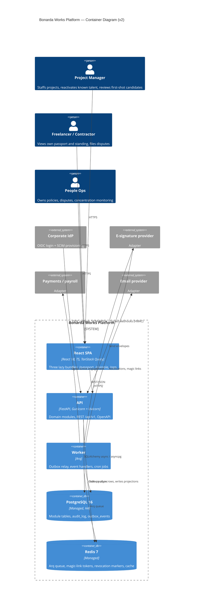
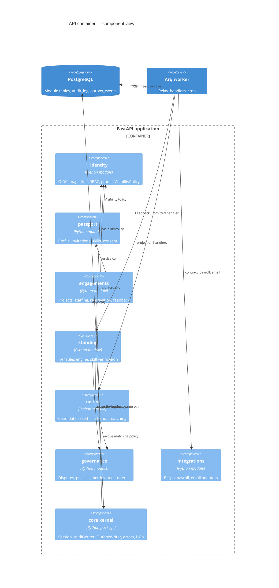
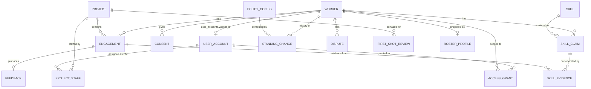
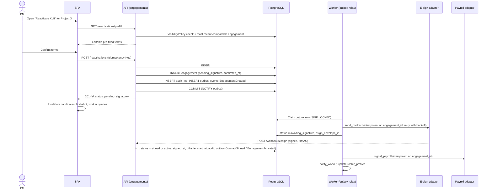
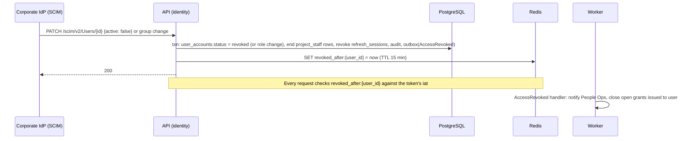

# Bonarda Works — Freelancer Passport & Reactivation Platform
### System Design Document (v2)

**Status:** Draft for review
**Supersedes:** `bonarda-system-design.md` (v1)
**Input:** `bonarda-requirements.md` (FR/NFR, Sections 1–11)
**Companions:** `bonarda-data-models.md` (ORM layer), `PROJECT_STRUCTURE.md` (repository layout)
**Stack constraints:** Python 3.12+ / FastAPI / Pydantic v2 backend, React + TypeScript frontend, REST + OpenAPI

### What changed from v1

| Area | v1 | v2 |
|---|---|---|
| Code structure | Horizontal layers (`routers/`, `services/`, `repositories/`) | Domain modules with CI-enforced boundaries (`import-linter`) |
| Async side effects | Insert row, then enqueue Arq job (dual write) | Transactional outbox — domain write, audit row and event commit atomically |
| PM scoping (FR-9.4) | Stated, no data to enforce it | `project_staff` table + single `VisibilityPolicy`; summary-vs-detail visibility |
| Audit trail (FR-7.3) | Per-table history only; `CASCADE` deletes could erase it | Append-only `audit_log`; history FKs are `RESTRICT`; erasure = anonymization |
| Rules (NFR-5.1, NFR-9.2) | Hard-coded | Versioned `policy_configs` with two-person activation |
| Skills | Free-text `skill_name`, invalid varchar GIN index | `skills` taxonomy, `skill_evidence` rows, GIN on `uuid[]` |
| First-shot (FR-4.6) | Endpoint named, selection undefined | Defined selection, ranking, rotation and impression logging |
| Missing NFRs | Consent, retention, MFA, 15-min revocation, i18n absent | All addressed (§8) |
| Dependencies | `python-jose` (unmaintained), `passlib` (unused) | `PyJWT`, `authlib`; `passlib` dropped |
| Gunicorn sizing | `2n+1` workers | 1 Uvicorn worker per core (async workers) |
| Frontend state | TanStack Query + Zustand, `react-window` | TanStack Query + URL state + `react-hook-form`; TanStack Virtual |

---

## 1. Executive summary — technical vision

We are building one async FastAPI modular monolith on PostgreSQL, where every state change commits atomically with its audit record and its outbound event, so a freelancer's passport and a PM's console always read the same trustworthy record. Fairness is enforced by the architecture, not by policy documents: first-shot candidates are a mandatory API resource, tier and matching rules are versioned data that People Ops controls, and every decision that affects a worker can be traced to the rule version and inputs that produced it.

---

## 2. Requirement clarifications and decisions

### 2.1 Resolved PRD open questions (PRD §11)

| # | Question | Decision | Architectural consequence |
|---|---|---|---|
| 1 | Who owns the concentration threshold? | People Ops, as a versioned `policy_configs` entry (`kind=concentration`) | Same mechanism as tiering and matching rules; no deploy to change it |
| 2 | Does the worker see their tier or only signals? | Both — tier label plus signals plus the policy version | `GET /workers/me/standing` returns an explanation object |
| 3 | Pilot jurisdictions | Ghana plus one EU country; single EU-region deployment | `workers.data_region` + `consents`; no multi-region topology |
| 4 | Identity / e-sign providers selected? | No | Generic OIDC for staff (MFA delegated to the IdP), SCIM for revocation, e-sign and payroll behind adapters with fakes |

### 2.2 Ambiguities resolved by this design

| # | Ambiguity | Decision |
|---|---|---|
| 1 | Where do projects and PM assignments come from? | This system owns `projects` and `project_staff`. A PSA/ERP sync adapter can be added later. |
| 2 | What does "PM sees only relevant workers" (FR-9.4) mean for search? | **Summary vs detail.** Search requires a project context and returns summary cards for consent-eligible workers. Detail (history, feedback text, disputes) requires a relationship (engaged on or shortlisted for the PM's project) or an active access grant. |
| 3 | FR-4.5 "without manual sync" — latency? | Same database record; the SPA invalidates queries after mutations and refetches on focus with 30s `staleTime`. No WebSockets. |
| 4 | Concentration cadence (NFR-5.3) | Nightly rollup; the governance dashboard tolerates up-to-24h staleness. |
| 5 | Device assumptions (FR-9.2, NFR-7.3) | Web-first, mobile-responsive. No native app, no offline mode. |
| 6 | Sizing (NFR-6.1) | Design target: 5,000 profiles, 500 concurrent PM sessions (~30–60 req/s peak). 10x path documented in §8.2. |
| 7 | When is a worker "dormant" (FR-9.7)? | Status is `active` while any engagement is `active`, otherwise `dormant`. Dormant workers remain searchable. |
| 8 | Does a disputed record still count toward standing? | Yes, until resolved. An upheld dispute sets `excluded_from_standing` on the record and triggers recalculation. |
| 9 | What is "billable start" (FR-5.3)? | The moment an engagement becomes `active`: contract signed **and** `start_date` reached. Time-to-start = `billable_start_at − confirmed_at`. |

---

## 3. Infrastructure stack

| Layer | Choice | Rationale |
|---|---|---|
| Backend framework | **FastAPI** | Constraint. Async-native, Pydantic-integrated, generates OpenAPI (NFR-9.1). |
| ORM / migrations | **SQLAlchemy 2.0 async + Alembic** | Chosen over Tortoise: mature ecosystem, typed `Mapped[]` models, reviewable versioned migrations (schema changes are part of the audit story). |
| Validation | **Pydantic v2**, separate from ORM models | Not SQLModel: API contracts (FR-8.4 future consumers) must evolve independently of table shape. |
| Primary datastore | **PostgreSQL 16** (managed, hot standby, PITR) | Relational integrity, JSONB for rule sets and structured answers, `LISTEN/NOTIFY` for the outbox relay, `pg_trgm` for name search. |
| Cache / queue / ephemeral auth | **Redis 7** | Arq queue, magic-link tokens, revocation markers, response cache. Nothing durable lives only in Redis. |
| Background jobs | **Arq** | Chosen over Celery: asyncio-native (shares code with the API), Redis-only broker, light to operate. Durability comes from the outbox, not the broker. |
| Auth libraries | **authlib** (OIDC), **PyJWT** (tokens) | `python-jose` is unmaintained. No passwords exist, so no `passlib`. |
| HTTP client | **httpx** + **tenacity** | Async, explicit timeouts, retries with backoff. |
| Frontend | **React 18 + TypeScript + Vite** | Constraint; TS catches contract drift at build time. |
| Server state | **TanStack Query** | The UI is server data with caching and invalidation; no global store needed. |
| Client state | **URL search params + `react-hook-form` + `zod`** | Zustand dropped: filters belong in the URL (shareable, back-button safe); forms own their own state. |
| Lists | **TanStack Virtual** | Handles variable row heights (roster cards, audit rows); replaces `react-window`. |
| UI primitives | **Radix UI** | Accessible primitives toward WCAG 2.1 AA. |
| i18n | **react-i18next** + `Intl` | English and French at launch, lazy namespaces. |
| API client | **openapi-typescript + openapi-fetch** | Generated from the backend spec; CI fails on drift. |
| Serving | **Gunicorn + Uvicorn workers**, 1 per core | See §8.2. |
| Containers | **Docker Compose** (dev, demo, MVA host); Kubernetes deferred | |
| Observability | **Prometheus + Grafana**, **structlog** | OpenTelemetry deferred. |

---

## 4. High-level architecture

### 4.1 C4 — Container view



### 4.2 Why a modular monolith

The requirements describe roughly seven domains but no independent scaling or team boundaries. At 5,000 profiles and 500 PM sessions, microservices would add network hops inside the 5-second reactivation budget (NFR-1.2), per-service retries and timeouts, and mandatory distributed tracing — cost with no matching benefit. A modular monolith keeps one deployable while CI enforces boundaries, so any module that later needs independent scaling can be extracted along an existing seam: its own tables, its own service interface, and its own outbox event feed.

---

## 5. Module architecture

### 5.1 Modules

Each module lives at `backend/app/modules/<name>/` with `router.py`, `service.py`, `repository.py`, `models.py`, `schemas.py`, and optionally `handlers.py` (event consumers).

| Module | Owns | Publishes |
|---|---|---|
| `identity` | User accounts, staff OIDC, worker magic links, role/permission matrix, `refresh_sessions`, `access_grants`, SCIM, `VisibilityPolicy` | `AccessRevoked`, `GrantCreated` |
| `passport` | Worker profile, invitations, skill claims, consents, dormant state, data export | `WorkerUpdated`, `ConsentChanged`, `WorkerInvited` |
| `engagements` | `projects`, `project_staff`, onboarding and reactivation flows, contract state, feedback | `EngagementCreated`, `ContractSigned`, `EngagementActivated`, `EngagementCompleted`, `FeedbackSubmitted` |
| `standing` | Tier rules engine, `skill_evidence` promotion, `standing_changes` | `StandingChanged`, `SkillVerified` |
| `roster` | `roster_profiles` read-model, candidate search, matching score, first-shot selection, `first_shot_reviews` | — |
| `governance` | Disputes, `policy_configs`, concentration rollups, audit-log queries, overrides | `DisputeResolved`, `ConcentrationAlert`, `PolicyActivated` |
| `integrations` | Adapters: e-sign, payroll, email, OIDC discovery; fakes for dev/demo; webhook verification | — |

**Shared kernel** (`backend/app/core/`): settings, DB engine and session, `AuditWriter`, `OutboxWriter`, event registry, i18n message catalog, problem+json errors, logging, request context (actor, correlation ID).

### 5.2 Boundary rules (enforced by `import-linter` in CI)

1. A module imports another module only through its `service.py` and `schemas.py`. Importing another module's `models`, `repository` or `router` fails CI.
2. Routers call services; services call repositories; only repositories touch `AsyncSession` queries.
3. Every state-changing service method writes its audit row via `AuditWriter` and its event via `OutboxWriter` on the **same `AsyncSession`**, so all three commit or roll back together. There is no API for enqueueing an Arq job directly from request code.
4. `roster` never joins other modules' tables at query time. It maintains `roster_profiles` from events and a nightly full rebuild.
5. Every worker-scoped route declares a `VisibilityPolicy` dependency (§8.1, Risk 1).

### 5.3 Transactional outbox

- `OutboxWriter.emit(session, event)` inserts an `outbox_events` row and issues `NOTIFY outbox` (delivered on commit only).
- The **relay** runs as a long-lived task in the worker process. It wakes on `LISTEN outbox` or a 2-second fallback poll, claims up to 100 rows with `SELECT … FOR UPDATE SKIP LOCKED WHERE dispatched_at IS NULL ORDER BY id`, enqueues one Arq job per registered handler with `_job_id = f"{event_id}:{handler}"` (Arq deduplicates on job ID), then sets `dispatched_at`.
- Handlers are idempotent: each records `(event_id, handler)` in `processed_events` inside its own transaction and skips if already present.
- Rows whose enqueue fails increment `attempts`; after 10 attempts the row is flagged and alerted.
- Dispatched rows older than 14 days are purged nightly.

### 5.4 C4 — Component view (API container)



---

## 6. Data strategy

### 6.1 Entities

Full ORM definitions are in `bonarda-data-models.md`. Summary:

| Table | Module | Key columns / notes |
|---|---|---|
| `user_accounts` | identity | `email` (unique), `role`, `auth_provider`, `oidc_subject` (unique, staff), `worker_id` (FK, workers only), `status` (active/revoked), `mfa_enrolled` |
| `refresh_sessions` | identity | `user_id`, `family_id`, `token_hash`, `expires_at`, `revoked_at` |
| `access_grants` | identity | `granted_to_id`, `scoped_worker_id`, `granted_by_id`, `reason`, `expires_at`, `revoked_at` |
| `workers` | passport | `full_name`, `email`, `worker_type` (freelancer/contractor), `status` (active/dormant/offboarded/anonymized), `onboarding_state` (invited/profile_complete), `standing_tier`, `data_region`, `locale`, `base_location`, `languages text[]`, `availability_status`, `available_from`, `dormant_since` |
| `skills` | passport | Taxonomy: `slug` (unique), `name_i18n jsonb` |
| `skill_claims` | passport | `worker_id`, `skill_id`, `verification_status` (unverified/self_reported/bonarda_verified), `source` (self/external/review); unique `(worker_id, skill_id)` |
| `consents` | passport | `worker_id`, `purpose` (cross_region_matching/external_prefill), `granted`, `legal_basis`, `granted_at`, `withdrawn_at`; unique `(worker_id, purpose)` |
| `projects` | engagements | `name`, `client_name`, `data_region`, `required_skill_ids uuid[]`, `starts_on`, `ends_on`, `status` |
| `project_staff` | engagements | `project_id`, `user_account_id`, `active_from`, `active_to` |
| `engagements` | engagements | `worker_id`, `project_id`, `path` (first_time/reactivation), `status`, `start_date`, `end_date`, `rate`, `currency`, `work_mode`, `location`, `contract_terms jsonb`, `prefilled_from_engagement_id`, `confirmed_at`, `signed_at`, `billable_start_at`, `esign_envelope_id`, `idempotency_key` (unique), `created_by_id` |
| `feedback` | engagements | `engagement_id` (unique), `reviewer_id`, `structured_answers jsonb`, `free_text`, `skill_ids_demonstrated uuid[]`, `excluded_from_standing` |
| `skill_evidence` | standing | `skill_claim_id`, `engagement_id`, `reviewer_id`; unique `(skill_claim_id, reviewer_id)` |
| `standing_changes` | standing | Append-only. `worker_id`, `previous_tier`, `new_tier`, `contributing_factors jsonb`, `policy_version_id`, `trigger_event_id`, `actor_id` (null = automated), `override_reason` |
| `roster_profiles` | roster | One row per worker: `display_name`, `status`, `data_region`, `cross_region_ok`, `standing_tier`, `skill_ids uuid[]`, `verified_skill_ids uuid[]`, `base_location`, `availability_status`, `available_from`, `engagements_total`, `engagements_last_12m`, `last_engaged_at`, `refreshed_at` |
| `first_shot_reviews` | roster | `project_id`, `worker_id`, `pm_id`, `outcome` (shown/shortlisted/contacted/engaged/passed), `reason_code`, `updated_at`; unique `(project_id, worker_id)` |
| `disputes` | governance | `worker_id`, `target_type` (feedback/standing_change/engagement), `target_id`, `reason`, `status`, `resolution` (upheld/rejected), `resolution_notes`, `resolver_id`, `resolved_at`, `due_at` |
| `policy_configs` | governance | `kind` (tiering/matching/concentration/retention), `version`, `rules jsonb`, `status` (draft/active/retired), `created_by_id`, `activated_by_id`, `activated_at`; unique `(kind, version)`; partial unique `(kind) WHERE status='active'`; check `activated_by_id <> created_by_id` |
| `concentration_rollups` | governance | `period_start`, `scope` (org/region), `engagements_total`, `engagements_repeat_3plus`, `share`, `first_shot_shown`, `first_shot_engaged`, `policy_version_id` |
| `audit_log` | core | `id bigint identity`, `occurred_at`, `actor_id`, `actor_role`, `action`, `target_type`, `target_id`, `before jsonb`, `after jsonb`, `reason`, `correlation_id` |
| `outbox_events` | core | `id bigint identity`, `event_id uuid`, `event_type`, `aggregate_id`, `payload jsonb`, `correlation_id`, `created_at`, `dispatched_at`, `attempts` |
| `processed_events` | core | `(event_id, handler)` primary key, `processed_at` |

### 6.2 ERD (core relationships)



### 6.3 Referential rules

- History-bearing children (`engagements`, `feedback`, `standing_changes`, `disputes`, `skill_evidence`) reference `workers` with `ON DELETE RESTRICT`. Workers are never hard-deleted.
- **Erasure (GDPR / Ghana DPA)** is the `anonymize_worker` job: it scrubs `full_name`, `email`, `base_location`, `languages`, free-text feedback and dispute reasons, sets `status=anonymized`, deletes the `user_accounts` row and consents, and keeps the structural history (dates, tiers, outcomes) needed for aggregate metrics. The job writes an audit row with no personal data in `before/after`.
- Informational references (`reviewer_id`, `granted_by_id`, `actor_id`) use `ON DELETE SET NULL`.
- `audit_log` and `standing_changes` are append-only: the application DB role has `INSERT, SELECT` only, and a trigger raises on `UPDATE`/`DELETE`.

### 6.4 Indexing

| Table | Index | Serves |
|---|---|---|
| `roster_profiles` | GIN on `skill_ids`, GIN on `verified_skill_ids` (native array GIN) | Candidate search by skill (FR-4.1, FR-6.1) |
| `roster_profiles` | B-tree `(data_region, availability_status)` `WHERE status IN ('active','dormant')` | Default search path |
| `roster_profiles` | GIN `display_name gin_trgm_ops` | Name search |
| `roster_profiles` | B-tree `(engagements_last_12m)` | First-shot pool |
| `engagements` | `(worker_id, start_date DESC)`; `(project_id)`; `(status) WHERE status IN ('pending_signature','awaiting_signature')` | Passport history; project view; stuck-engagement detector |
| `project_staff` | `(user_account_id) WHERE active_to IS NULL` | `VisibilityPolicy` |
| `access_grants` | `(granted_to_id, scoped_worker_id, expires_at) WHERE revoked_at IS NULL` | `VisibilityPolicy` |
| `audit_log` | `(target_type, target_id, occurred_at DESC)`; BRIN `(occurred_at)` | Per-record trail; time-range scans |
| `outbox_events` | `(id) WHERE dispatched_at IS NULL` | Relay claim |
| `disputes` | `(status, due_at)` | People Ops queue, SLA reminders |
| `standing_changes` | `(worker_id, created_at DESC)` | Standing explanation |

`audit_log` is not partitioned in v1 (well under 10M rows/year at launch scale); monthly range partitioning is the documented path if it exceeds that.

### 6.5 Consistency model

| Guarantee | Applies to |
|---|---|
| **Atomic, same transaction** | Domain write + `audit_log` row + `outbox_events` row: engagement creation and state changes, feedback, disputes, grants, policy activation, overrides |
| **Eventual, seconds** (outbox relay) | Tier recalculation, skill promotion, `roster_profiles` updates, notifications, e-sign dispatch, payroll signal |
| **Eventual, nightly** | Concentration rollups, full `roster_profiles` rebuild (drift repair), retention enforcement |

Tier recalculation stays off the request path: feedback submission must not wait on the rules engine, and recalculation must be re-runnable from events.

### 6.6 Retention (NFR-4.4)

Stored as the active `policy_configs` entry of `kind=retention`, enforced by the nightly `retention_enforcement` job. Seed values below require legal sign-off before live data; the mechanism does not depend on them.

| Category | Seed retention | Action at expiry |
|---|---|---|
| Dormant worker profile | 3 years after last engagement end | `anonymize_worker` |
| Feedback and standing history | 6 years | Anonymize free text; keep structure |
| Disputes | 6 years after resolution | Anonymize reason and notes |
| Audit log | 7 years | Delete rows |
| Magic-link tokens | 15 minutes | Redis TTL |
| Dispatched outbox rows | 14 days | Delete |

---

## 7. Component breakdown

### 7.1 Roles and visibility

Fixed role set (FR-9.3): `pm`, `people_ops`, `finance`, `worker`, `admin`. Permissions are a static matrix in `identity/permissions.py`, exported to `docs/permissions.md` by a CI step so the reviewed document cannot drift from code.

`VisibilityPolicy` (FastAPI dependency) resolves, for caller × worker:

| Level | Who | Sees |
|---|---|---|
| `self` | The worker | Everything about themselves, including all feedback text (FR-2.4) and standing factors |
| `detail` | People Ops; admin; a PM who has an active `project_staff` row on a project where the worker has an engagement or a `first_shot_reviews` row with outcome `shortlisted`, `contacted` or `engaged`; a PM with an active, unexpired grant | Engagement history, feedback, standing factors, disputes status |
| `summary` | A PM searching within a project they staff, for workers in the project's region or with `cross_region_ok` | Name, verified and self-reported skills, tier, availability, location, engagement count |
| `none` | Anyone else, including finance for worker profiles | 404 (not 403, to avoid confirming existence) |

Responses use distinct schemas per level (`WorkerSelf`, `WorkerDetail`, `WorkerSummary`), never one schema with nullable fields.

### 7.2 API surface

All routes are under `/api/v1`. Errors are RFC 9457 `application/problem+json`. List endpoints use keyset pagination (`?cursor=&limit=`, max 100). Mutating endpoints that can be retried by a client accept an `Idempotency-Key` header.

**identity**

| Method & path | Purpose | Role |
|---|---|---|
| `GET /auth/oidc/login` → `GET /auth/oidc/callback` | Staff login; rejects ID tokens without MFA in `amr`/`acr` | staff |
| `POST /auth/magic-link` | Request link (always 202; rate-limited per email and IP) | public |
| `POST /auth/magic-link/verify` | Exchange token for session | public |
| `POST /auth/refresh` | Rotate refresh token (cookie) | any |
| `POST /auth/logout` | Revoke refresh family | any |
| `GET /me` | Current user, role, locale | any |
| `PATCH /scim/v2/Users/{id}` | Deactivation or group (team) change → revoke | IdP (bearer) |
| `POST /access-grants`, `GET /access-grants`, `DELETE /access-grants/{id}` | Scoped, expiring grants with reason (FR-9.5) | people_ops |

**passport**

| Method & path | Purpose | Role |
|---|---|---|
| `POST /workers/invitations` | Invite a first-time worker by email for a project (FR-5.1); creates worker `onboarding_state=invited` and sends a magic link | pm |
| `GET /workers/{id}` | Profile shaped by visibility level | any (policy) |
| `PATCH /workers/me` | Self-reported fields: languages, availability, location, locale (FR-1.5) | worker |
| `POST /workers/me/skills`, `DELETE /workers/me/skills/{skill_id}` | Self-reported claims (cannot set `bonarda_verified`) | worker |
| `GET /workers/me/standing` | Tier, contributing signals, policy version, change history (FR-1.3) | worker |
| `GET /workers/me/consents`, `PUT /workers/me/consents/{purpose}` | Consent management (NFR-4.3) | worker |
| `POST /workers/me/export` | 202; job emails a signed, 24h download link (FR-1.7, deferred past MVA) | worker |
| `GET /skills?q=` | Taxonomy lookup | any |

**engagements**

| Method & path | Purpose | Role |
|---|---|---|
| `POST /projects`, `GET /projects`, `GET /projects/{id}` | Project CRUD | pm, people_ops |
| `PUT /projects/{id}/staff` | Assign PMs | people_ops, owning pm |
| `GET /reactivations/prefill?worker_id=&project_id=` | Terms from most recent comparable engagement (FR-4.4) | pm (detail visibility) |
| `POST /reactivations` | Create reactivation engagement; 201 `pending_signature` (FR-4.3) | pm |
| `POST /engagements` | First-time engagement; requires `onboarding_state=profile_complete` | pm |
| `POST /engagements/{id}:complete` | Mark completed; opens feedback | pm |
| `POST /engagements/{id}/feedback` | Structured answers required, free text optional (FR-2.3/2.4) | pm on that project |
| `POST /engagements/{id}/contract:retry` | Re-emit contract dispatch for a stuck engagement | pm |
| `POST /webhooks/esign` | Provider callback; HMAC-verified | provider |

**roster**

| Method & path | Purpose | Role |
|---|---|---|
| `GET /projects/{id}/candidates?skill_ids=&availability=&location=&q=&cursor=` | Scored candidates, summary level (FR-4.1, FR-6.1) | pm staffed on project |
| `GET /projects/{id}/first-shot` | First-shot panel; logs `shown` impressions (FR-4.6) | pm staffed on project |
| `POST /projects/{id}/first-shot/{worker_id}/review` | Record outcome and reason code (FR-4.7) | pm staffed on project |

**governance**

| Method & path | Purpose | Role |
|---|---|---|
| `POST /disputes` | File dispute on own record (FR-1.4) | worker |
| `GET /disputes`, `PATCH /disputes/{id}` | Queue and resolution | people_ops (workers: own only) |
| `GET /governance/concentration`, `GET /governance/overview` | Concentration, dispute volume, tier distribution (FR-7.1, FR-4.8) | people_ops, pm leadership (admin-assigned flag) |
| `GET /governance/audit-log?target_type=&target_id=` | Audit trail (FR-7.3) | people_ops, admin |
| `GET /policies/{kind}/versions`, `POST /policies/{kind}/versions`, `POST /policies/{kind}/versions/{v}:activate` | Versioned rules with two-person activation (NFR-5.1, NFR-9.2) | people_ops |
| `POST /standing-overrides` | Manual tier change; `reason` required | people_ops |

### 7.3 Standing rules engine (FR-3.1–3.4, FR-2.2)

`standing.service.evaluate(worker_id, policy)` is a pure function over the worker's non-excluded, completed engagements and feedback; it returns `(tier, factors)`. The handler compares with the stored tier and, if different, writes `standing_changes` (with `policy_version_id`, `trigger_event_id`, `factors`), updates `workers.standing_tier`, audits, and emits `StandingChanged`. Activating a new tiering policy triggers a full re-evaluation job.

Seed tiering policy v1:

```json
{
  "window_months": 24,
  "tiers": [
    {"tier": "tier_2", "min_completed": 3, "min_distinct_reviewers": 2, "min_positive_ratio": 0.8},
    {"tier": "tier_1", "min_completed": 1, "min_distinct_reviewers": 1, "min_positive_ratio": 0.6}
  ],
  "default": "unrated",
  "skill_verification": {"min_distinct_reviewers": 2}
}
```

`positive_ratio` is the share of `true` answers across all structured questions in the window. A skill becomes `bonarda_verified` when `skill_evidence` rows from distinct reviewers reach `min_distinct_reviewers`; evidence is created when feedback lists the skill in `skill_ids_demonstrated`. Structured questions (FR-2.3) are a Pydantic model in `engagements.schemas`: `delivered_on_agreed_dates`, `handled_scope_changes_without_escalation`, `would_reengage`.

### 7.4 Matching and first-shot (FR-6.1, FR-6.2, FR-4.6, FR-3.4)

Weights and limits come from the active `matching` policy. Every candidate response includes a `score_breakdown` object.

**Candidate score** over `roster_profiles`, for project required skills *S*:

```
score = 0.50 × |verified ∩ S| / |S|
      + 0.20 × |self_reported ∩ S| / |S|
      + 0.15 × availability_fit        # 1 if available by project start, 0.5 if within 14 days, else 0
      + 0.15 × tier_weight             # unrated 0, tier_1 0.5, tier_2 1
```

Prior selection frequency and engagement count have weight 0. Tier is capped at 15% of the score.

**First-shot pool**
- Eligible: status `active` or `dormant`; `onboarding_state=profile_complete`; every skill in *S* claimed at `self_reported` or `bonarda_verified`; `availability_fit > 0`; region-eligible (same `data_region` or `cross_region_ok`).
- Underused: `engagements_last_12m ≤ 1` (policy value).
- Never filtered by tier.
- Exclude workers already in the top 10 candidates for this project.

**Ranking:** skill coverage descending, then `engagements_last_12m` ascending, then `hash(project_id, worker_id)` — deterministic per project, rotating across projects. Panel size k = 5 (policy value).

**Impression logging:** serving the panel upserts `first_shot_reviews` rows with outcome `shown`; PM actions move them to `shortlisted`, `contacted`, `engaged` or `passed` (with a reason code from a fixed list). `shortlisted`, `contacted` or `engaged` grants the PM detail visibility for that worker; `passed` does not.

### 7.5 Sequence — reactivation



Synchronous system time is one indexed read plus one transaction (target < 500 ms), within NFR-1.2's 5 seconds. If the e-sign provider is down, the engagement is already recorded and visible on the passport (NFR-2.2); dispatch waits in the outbox or retries.

### 7.6 Sequence — staff access revocation (NFR-3.5, FR-9.12)



### 7.7 Background work (Arq worker)

**Event handlers**

| Event | Handlers |
|---|---|
| `EngagementCreated` | `send_contract`; `roster.refresh_worker` |
| `ContractSigned` | `engagements.activate_if_due` |
| `EngagementActivated` | `signal_payroll`, `notify_worker`, `passport.set_active`, `roster.refresh_worker` |
| `EngagementCompleted` | `passport.set_dormant_if_idle`, `notify_feedback_due` (to PM) |
| `FeedbackSubmitted` | `standing.record_skill_evidence`, `standing.recalculate` |
| `StandingChanged`, `SkillVerified`, `WorkerUpdated`, `ConsentChanged` | `roster.refresh_worker`; `notify_worker` for standing changes |
| `DisputeResolved` | `notify_worker`; if upheld: set `excluded_from_standing`, `standing.recalculate` |
| `PolicyActivated(tiering)` | `standing.recalculate_all` |
| `AccessRevoked` | `notify_people_ops`, revoke grants issued to the user |
| `WorkerInvited` | `send_magic_link` |

**Cron**

| Schedule | Job |
|---|---|
| Continuous | `outbox_relay` |
| Every 5 min | `expire_access_grants` (audit rows; reads already check `expires_at`) |
| Every 15 min | `stuck_engagement_detector` — `pending_signature`/`awaiting_signature` beyond policy threshold (default 30 min / 72 h) flags the engagement for the PM and alerts |
| Hourly | `activate_due_engagements` — signed engagements whose `start_date` has arrived |
| Nightly 02:00 UTC | `concentration_rollup` (+ `ConcentrationAlert` if share > threshold), `roster_rebuild`, `retention_enforcement`, `purge_outbox` |
| Daily 08:00 UTC | `dispute_sla_reminder` |

Jobs that fail after 5 retries (exponential backoff) move to a dead-letter list; `dead_letter_total` alerts within 5 minutes (NFR-10.2).

### 7.8 React frontend

**Bundles** (route-level `React.lazy`):
- `/passport` — worker-facing, mobile-first, **≤ 150 KB gzipped JS** enforced by `size-limit` in CI (NFR-1.3, NFR-7.3). No charting library in this bundle.
- `/console` — PM staffing, reactivation, feedback.
- `/ops` — People Ops: disputes, policies, governance dashboard, audit log.

**Providers**
- `AuthProvider` — access token in memory only; silent refresh through the httpOnly cookie; role-based idle timer (PM/staff 30 min, worker 24 h; NFR-3.7); on 401 after refresh failure, routes to login.
- `QueryProvider` — TanStack Query client: `staleTime` 30s, `refetchOnWindowFocus`, retry only on network errors and 5xx.
- `I18nProvider` — `react-i18next`, `en` and `fr`, namespaces per bundle; all dates, numbers, currency through `Intl` using the user's `locale` (NFR-8.x). A lint rule bans string literals in JSX.

**Hooks**

| Hook | Wraps | Notes |
|---|---|---|
| `useCandidates(projectId, filters)` | `useInfiniteQuery` → `/candidates` | Filters read from and written to URL search params; debounced text query |
| `useFirstShot(projectId)` | `/first-shot` | Rendered by the same `StaffingPage` layout as candidates — no toggle can hide it |
| `useFirstShotReview()` | mutation | Invalidates `first-shot` |
| `useReactivation(workerId, projectId)` | prefill query + mutation | Idempotency key generated once when the flow opens, reused on retry; on success invalidates candidates, first-shot, worker |
| `usePassport()`, `useStandingExplanation()` | `/workers/{id}`, `/workers/me/standing` | |
| `useDisputes()`, `usePolicies(kind)`, `useConcentration()`, `useAuditLog(target)` | governance endpoints | |

**Large data:** server keyset pagination (25 per page) + TanStack Virtual for the candidate list and audit log; passport engagement history paginated at 20.

**Forms:** `react-hook-form` + `zod` schemas generated from the OpenAPI types where possible.

**Accessibility:** Radix primitives; `axe` checks in component tests and Playwright E2E (NFR-7.1).

---

## 8. Non-functional requirements

### 8.1 Security

**Decision: stateless JWT access tokens with rotating refresh sessions, not server-side sessions.** Any API process validates a request without a shared session lookup; revocation is handled by one Redis marker per user plus short token lifetimes.

- **Access token:** PyJWT, 10-minute TTL, claims `sub`, `role`, `iat`, `jti`, `amr`.
- **Refresh token:** opaque random value, stored hashed in `refresh_sessions`, rotated on every use, httpOnly `Secure` `SameSite=Strict` cookie scoped to `/api/v1/auth/refresh`. Reuse of a rotated token revokes the whole `family_id`.
- **Revocation (NFR-3.5):** SCIM event → `revoked_after:{user_id}` in Redis, checked on every request against `iat`. If Redis is unavailable the check fails open; the 10-minute token TTL keeps worst-case revocation within 15 minutes.
- **Staff MFA (FR-9.9, NFR-3.6):** enforced by the IdP; the callback rejects ID tokens whose `amr`/`acr` do not indicate MFA. Login requests send `max_age` of 30 days so "remember device" cannot extend beyond it.
- **Worker auth (FR-9.2, FR-9.8):** single-use magic-link tokens (32 random bytes, stored as SHA-256 in Redis, 15-min TTL), rate-limited 5/hour per email and 20/hour per IP. Recovery if the email is lost: People Ops verifies identity out-of-band and changes the email; the change is audited and the old refresh family is revoked. Optional worker TOTP (FR-9.10) is post-MVA.
- **Temporary grants (FR-9.5, NFR-3.8):** reads check `expires_at > now() AND revoked_at IS NULL`, so expiry is immediate without any job.
- **CSRF:** not applicable to API calls (bearer header); the refresh cookie is `SameSite=Strict` and path-scoped.
- **Transport and storage (NFR-3.1):** TLS 1.2+ at the load balancer; managed Postgres and Redis with AES-256 at rest; backups encrypted.
- **Webhooks:** HMAC signature and timestamp verification; replay window 5 minutes.
- **Rate limiting:** at the reverse proxy per IP; per-email limits for magic links in the app.
- **Audit (NFR-3.3, FR-9.13):** every administrative action, grant, role change, revocation, export and override writes `audit_log` with actor, target, before/after and reason.
- **Pre-live gate (NFR-3.4):** external penetration test.

### 8.2 Scalability and concurrency

**FastAPI concurrency.** Each Uvicorn worker runs one event loop that keeps many I/O-bound requests (Postgres, Redis, outbound HTTP) in flight at once. The GIL limits each process to one core, so Gunicorn runs **one Uvicorn worker per core**. The `2n+1` rule is for synchronous workers blocked on I/O; for async workers it only adds CPU contention and multiplies DB connections.

- **Connection budget:** asyncpg pool of 10 per API process and 10 for the worker; `api_processes × 10 + 10 < max_connections − 20` (headroom for admin and migrations).
- **Event-loop protection:** Ruff `ASYNC` rules in CI; every `httpx` call has explicit connect/read timeouts (2s/10s); CPU-heavy work (exports, rollups, full re-evaluation) runs in the worker.
- **Launch sizing:** one 4-vCPU API host (4 workers), one worker host, managed Postgres (2 vCPU, 8 GB, hot standby), managed Redis.
- **Verification:** Locust profile of 500 concurrent PM sessions must meet p95 ≤ 2s on search and profile views before launch (NFR-1.1).
- **10x path (NFR-6.1), no rework:** add stateless API replicas behind the load balancer; add PgBouncer in transaction mode (asyncpg `statement_cache_size=0`); route `roster` and `governance` reads to a read replica — both already read event-maintained tables and tolerate replica lag.

**Frontend with large data.** The server never returns unbounded lists (keyset pagination, max 100); the client virtualizes long lists and renders only visible rows; per-bundle size budgets keep the worker-facing passport fast on low-end devices.

### 8.3 Observability

- **Metrics:** `prometheus-fastapi-instrumentator` (latency, status, in-flight per route) plus custom: `outbox_pending`, `outbox_lag_seconds`, `dead_letter_total`, `reactivation_duration_seconds`, `integration_errors_total{provider}`, `stuck_engagements`, `magic_link_requests_total`.
- **Alerts (Grafana):** p95 > 2s on search/profile routes (NFR-1.1); outbox lag > 60s; any dead-letter job; integration error rate spike within 5 min (NFR-10.2); stuck engagements > 0 for 1h.
- **Logs:** structlog JSON; `correlation_id` from the request header (or generated) is stored in `outbox_events.correlation_id` and bound in every handler, so one reactivation is traceable across the async boundary.
- **Domain events (NFR-10.1):** reactivation started/completed, dispute filed/resolved and standing changed are outbox events and audit rows — the same records feed debugging and the governance dashboard.
- **Tracing:** OpenTelemetry deferred; correlation IDs cover the need at launch scale.

### 8.4 Reliability (NFR-2.x)

- **Idempotency:** `Idempotency-Key` on `POST /reactivations` (unique column); handler dedupe via `processed_events`; external calls keyed on `engagement_id`.
- **Retries:** tenacity exponential backoff with jitter on all integration calls; dead-letter after 5 attempts.
- **Degraded modes:** Redis down → reads fall back to Postgres, writes still land in the outbox, relay catches up; e-sign down → engagements wait in `pending_signature` with a visible status and retry action; passport and console reads never depend on an integration being up (NFR-2.2).
- **Database:** managed Postgres with hot standby and point-in-time recovery; migrations use expand/contract so deploys need no downtime.
- **Maintenance (NFR-2.3):** windows scheduled 22:00–02:00 UTC, announced 48h ahead via an in-app banner fed by a config value.

### 8.5 Privacy, compliance, fairness

- **Consent (NFR-4.3):** a worker outside the project's `data_region` appears in candidates or first-shot only with `cross_region_matching` consent; withdrawing consent removes them within one relay cycle.
- **Data subject requests (NFR-4.2):** export job (FR-1.7) and correction via self-edit or dispute; disputes carry `due_at` (seed: 30 days).
- **Fairness (NFR-5.x):** deterministic, versioned tier and matching policies; overrides require reasons; first-shot panel is a mandatory API resource and UI region; concentration is computed nightly with alerting.

### 8.6 Accessibility and localization

WCAG 2.1 AA via Radix primitives and `axe` in CI; usability sessions with PMs and one freelancer cohort before launch (NFR-7.2). English and French catalogs; backend error messages carry stable codes that the frontend localizes; skill names use `name_i18n`.

---

## 9. Top 3 technical risks

| # | Risk | Why it is real here | Mitigation |
|---|---|---|---|
| 1 | **Authorization leak across the PM visibility boundary** | One route that skips `VisibilityPolicy` exposes feedback and dispute data — a GDPR incident and a breach of worker trust | Policy is a FastAPI dependency on every worker-scoped route; per-level response schemas (`WorkerSummary`/`WorkerDetail`/`WorkerSelf`); role × route test matrix; a CI test enumerates routes and fails any worker-scoped route without the dependency; 404 for `none` |
| 2 | **Duplicated or lost async side effects** (double contracts, stale roster tiers, missing payroll signal) | Reactivation's value depends on integrations completing exactly once | Transactional outbox; `processed_events` dedupe; external calls keyed on `engagement_id`; outbox lag and dead-letter alerts; nightly `roster_rebuild`; stuck-engagement detector with PM retry |
| 3 | **Event-loop stalls or pool exhaustion under load** (GIL) | One blocking call stalls every request on that process; oversized worker counts exhaust Postgres connections | Ruff `ASYNC` lint; timeouts on all I/O; one worker per core; explicit connection budget; pre-launch Locust test at 500 sessions |

Frontend bundle size is managed by a CI budget (`size-limit`, Lighthouse CI on a throttled mobile profile) rather than carried as an open risk.

---

## 10. V1 roadmap — Minimum Viable Architecture

The MVA proves the core loop end to end: a PM reactivates a known freelancer, the freelancer sees it on their passport, and a qualified underused freelancer is surfaced alongside.

**In the MVA**
- All seven modules in thin form:
  - `identity`: OIDC via Keycloak in Docker Compose (dev/demo IdP), magic links delivered to Mailpit, fixed role matrix, `VisibilityPolicy`, access grants via API.
  - `passport`: profile, invitations, self-reported skills, consents, standing explanation.
  - `engagements`: projects, staffing, reactivation, first-time path, completion, feedback.
  - `standing`: seeded tiering policy v1, skill verification.
  - `roster`: candidates and first-shot with impression logging.
  - `governance`: disputes, audit-log viewer, concentration rollup with one chart, policy activation via API.
  - `integrations`: fake e-sign (auto-signs after a delay) and fake payroll adapters.
- Built from day one because they cannot be retrofitted: outbox, `audit_log`, `VisibilityPolicy`, `policy_configs`, i18n scaffolding with French catalog.
- Single host running Docker Compose: api, worker, postgres, redis, keycloak, mailpit, spa.
- `/metrics` endpoint and structlog JSON logs.
- CI: ruff (incl. `ASYNC`), mypy, import-linter, pytest (unit + Postgres integration), OpenAPI client drift check, `size-limit`.

**Gates before any live worker data**
- SCIM revocation wired to the chosen IdP
- Real e-sign and payroll adapters
- External penetration test (NFR-3.4)
- Legal sign-off on retention periods, DPIA, and cross-border basis
- Locust load test passing NFR-1.1

**Deferred past V1**
- Worker TOTP (FR-9.10)
- Self-service data export (FR-1.7) and external credential pre-fill (FR-2.5, FR-5.2)
- Policy editor UI (policies managed via API)
- Grafana dashboards and alert routing (metrics exposed from day one)
- PgBouncer, read replica, Kubernetes, OpenTelemetry

**Why this sequencing:** every deferred item either has an interim workaround (API calls instead of an editor UI, an engineer-run export) or matters only at a scale the pilot will not reach. Every MVA item is either on the core loop or is a foundation (audit, outbox, visibility, versioned policy) that is expensive to add once data exists.

---

## 11. Requirement traceability

| Requirement | Design element |
|---|---|
| FR-1.1, FR-9.6, FR-9.7 | `workers` persists across engagements; `active`/`dormant` derived from engagements (§2.2 #7) |
| FR-1.3, FR-1.4 | `GET /workers/me/standing`; `POST /disputes` with typed targets |
| FR-1.5 | `PATCH /workers/me`, self-reported skills |
| FR-2.1, FR-2.2 | `verification_status`; `skill_evidence` + distinct-reviewer threshold |
| FR-2.3, FR-2.4 | Structured-answer Pydantic model (422 if missing); optional free text visible at `self` level |
| FR-3.1–3.3, NFR-5.1 | Pure rules engine, versioned `policy_configs`, append-only `standing_changes` with factors and policy version |
| FR-3.4, FR-6.1, FR-6.2 | Tier capped at 15% of score, never a filter; selection frequency weight 0; `score_breakdown` |
| FR-4.1, FR-4.2 | `/projects/{id}/candidates`; `roster_profiles`; detail view includes last time-to-start |
| FR-4.3, FR-4.4, FR-4.5 | Prefill + `POST /reactivations`; same `engagements` row read by passport; query invalidation |
| FR-4.6, FR-4.7, NFR-5.2 | `/first-shot` resource on the same page; `first_shot_reviews` impressions and outcomes |
| FR-4.8, FR-7.1, FR-7.2, NFR-5.3 | `concentration_rollups` nightly; `ConcentrationAlert` |
| FR-5.1, FR-5.3 | Invitations + `path=first_time`; `confirmed_at` → `billable_start_at` per path |
| FR-7.3, FR-9.13, NFR-3.3 | `audit_log` in the same transaction as each change |
| FR-8.1–8.3 | `integrations` adapters; OIDC; e-sign webhooks; payroll signal |
| FR-8.4, NFR-9.1 | Versioned REST API with OpenAPI; schemas independent of tables |
| FR-9.1–9.5, FR-9.12, NFR-3.2, NFR-3.5, NFR-3.8 | OIDC + magic link; role matrix; `VisibilityPolicy`; grants; SCIM revocation |
| FR-9.9, FR-9.11, NFR-3.6, NFR-3.7 | IdP-enforced MFA checked via `amr`/`acr`; role-based idle timeouts |
| NFR-1.1–1.3 | Single-table search; one-transaction reactivation; 150 KB passport bundle |
| NFR-2.1, NFR-2.2 | HA Postgres; outbox decouples integrations from reads |
| NFR-4.1–4.4 | `data_region`, `consents`, anonymization, retention policy |
| NFR-6.1, NFR-6.2 | §8.2 sizing and 10x path; `worker_type` enum |
| NFR-7.x, NFR-8.x | Radix + axe; react-i18next + `Intl`; `name_i18n` |
| NFR-9.2 | Policies changed via API with two-person activation, no deploy |
| NFR-10.1, NFR-10.2 | Outbox events + audit; dead-letter and integration alerts |

---

## 12. Items requiring external sign-off

These do not block building the MVA; they block handling live worker data.

1. Retention periods (§6.6) — legal.
2. Legal basis for cross-border matching and the consent wording (§8.5) — legal.
3. IdP selection and SCIM support (§7.6) — IT.
4. E-sign and payroll provider selection (§5.1 `integrations`) — IT and Finance.
5. Seed tiering and matching weights (§7.3, §7.4) — People Ops.
6. Concentration threshold (seed 65%) — People Ops.
